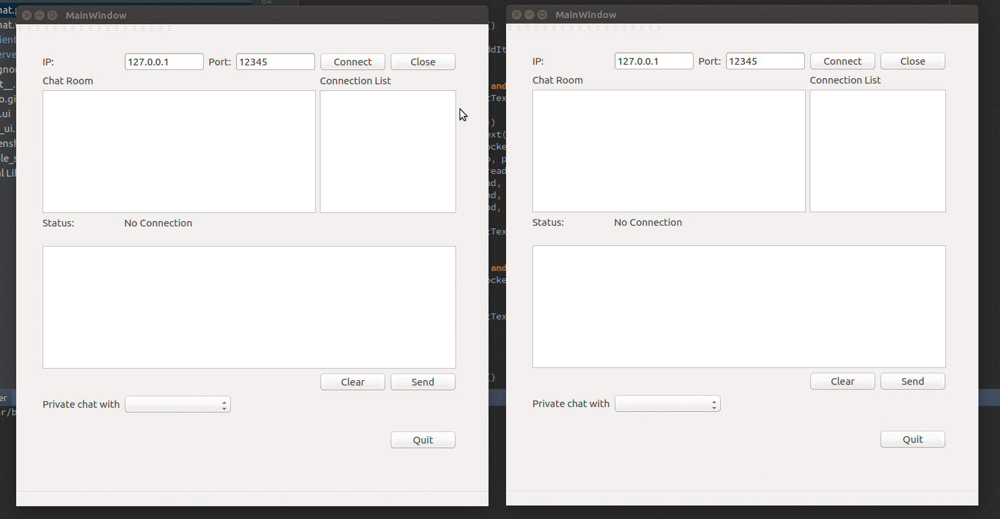

# SocketChat

A simple chat-room implementation with python raw socket and multiple-threading. 

Good start for the socket programming in python

## Feature

*  Public group chat
*  Private peer-to-peer chat

## Demo



## Usage:

1. Start Server

  ```
  python server.py
  ```

2. Start client(s)

  ```
  python client.py
  ```

**Note** : pyqt4 is required to display the UI, you can use qt designer to re-design it and execute `pyuic4 chat.ui -o chat.py` to generate python file
